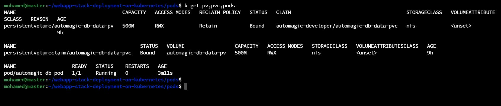

<a name="readme-top"></a>

[![LinkedIn][linkedin-shield]][linkedin-url]


<!-- PROJECT LOGO -->
<br />
<div align="center">
  
  <h3 align="center">Provision NFS Persistent Volumes in Kubernetes</h3>
</div>


<!-- TABLE OF CONTENTS -->
<details>
  <summary>Table of Contents</summary>
  <ol>
    <li><a href="#about-the-project">About The Project</a></li>
    <li><a href="#description">Description</li>
    <li><a href="#setup-nfs-server-on-ubuntu">Setup NFS Server on Ubuntu</a></li>
    <li><a href="#test-the-nfs-server-from-a-client">Test The NFS Server From a Client</a></li>
    <li><a href="#create-a-nfs-volume">Create a NFS Volume</a></li>
    <li><a href="#create-a-nfs-persistent-volume-pv-and-a-persistent-volume-claim-pvc">Create a NFS Persistent Volume (PV) and a Persistent Volume Claim (PVC)</a></li>
    <li><a href="#contact">Contact</a></li>
    <li><a href="#references">References</a></li>
  </ol>
</details>


<!-- ABOUT THE PROJECT -->
## About The Project



* Project Name: Provision NFS Persistent Volumes in Kubernetes
* Version: v1.0.0
* Organization Department: Technology

## Description

In this written guide, I documeneted my hands-on experience while creating an NFS server on an Ubuntu server, then use it to create PV inside a Kubernetes cluster.

<p align="right">(<a href="#readme-top">back to top</a>)</p>

## Setup NFS Server on Ubuntu

1. Install `nfs-kernel-server` package:

    ```
    apt update
    apt install -y nfs-kernel-server
    systemctl enable --now nfs-kernel-server
    systemctl status nfs-kernel-server
    ```


2. Create a new directory to mount it and remove ownership of the directory and give all permissions on the directory to avoid any access issues.
    
    ```
    mkdir -p /mnt/nfs
    chown -R nobody:nogroup /mnt/nfs
    chmod -R 777 /mnt/nfs/
    ```


3. Export the directory and allow the worker servers to access it.
    ```
    echo '/mnt/nfs/ WORKER_1_IP_HERE(rw,sync,no_subtree_check) WORKER_2_IP_HERE(rw,sync,no_subtree_check)' >> /etc/exports
    exportfs -a
    systemctl restart nfs-kernel-server
    systemctl status nfs-kernel-server
    ```


4. Allow NFS port in the UFW firewall.
```
ufw allow from WOKER_IP to any port nfs
```


<p align="right">(<a href="#readme-top">back to top</a>)</p>

## Test The NFS Server From a Client

1. Install `nfs-common` package.

    ```
    apt update
    apt install -y nfs-common
    ```


2. Mount the NFS directory on a test directory, then test it.

    ```
    mkdir test_mount
    mount 157.230.12.200:/mnt/nfs/ ./test_mount/
    ```


3. We can view the files created on the client from the NFS server itself:


<p align="right">(<a href="#readme-top">back to top</a>)</p>

## Create a NFS Volume

1. First, we need to create the directory that we need to use as a volume. on the NFS server, we shared the directory `/mnt/nfs/`. Let's create a directory inside it and use it as a volume.

    ```
    sudo mkdir -p /mnt/nfs/automagic_stack/db_data
    ```

2. We need to remove the ownership permissions on the directory `/mnt/nfs/automagic_stack/` as it will include several mount points that I will create later for my application. Each will have their own UID and GID.
    
    ```
    sudo chown nobody:nogroup /mnt/nfs/automagic_stack/
    ```

3. I use a Postgres image in my test container and in the deployment file, I set it to run with the UID of the `postgres` user inside the container; which is `999`. So, we need to set the right permissions on the mount point to allow user `postgres` to use this directory.

    ```
    sudo chown 999:999 /mnt/nfs/automagic_stack/db_data
    ```

4. Add the volume and mount it in the pod definition file.


5. And we can of course verify that everything is working as expected:


<p align="right">(<a href="#readme-top">back to top</a>)</p>

## Create a NFS Persistent Volume (PV) and a Persistent Volume Claim (PVC)

1. First, we need to create the directory that we need to use as a volume and set the correct permissions on it; to match the UID of the user running in the container. Remember, we need to create it inside the NFS directory that we created earlier.


2. Install `nfs-common` package on the worker nodes; to be able to mount the NFS volume.

```
sudo apt install nfs-common
```


3. Create a PV definition file with the path we've just created it.

    ```
    apiVersion: v1
    kind: PersistentVolume
    metadata:
      name: automagic-db-data-pv
    spec:
      capacity:
        storage: 500M
      accessModes:
        - ReadWriteMany
      persistentVolumeReclaimPolicy: Retain
      storageClassName: nfs
      nfs:
        path: /mnt/nfs/automagic_stack/db_data/
        server: 157.230.12.200
    ```

4. Create a PVC definition file with the same spec requirements in the PV.

    ```
    apiVersion: v1
    kind: PersistentVolumeClaim
    metadata:
      name: automagic-db-data-pvc
    spec:
      accessModes:
        - ReadWriteMany
      resources:
        requests:
          storage: 500M
      storageClassName: nfs
    ```

5. Create the previous resources in the cluster. The status of the PV and PVC should be `Bound`.


6. We should be able to use the created PVC in any pod definition now:


<p align="right">(<a href="#readme-top">back to top</a>)</p>

## Contact

Mohamed AbdelGawad Ibrahim - [@m-abdelgawad](https://www.linkedin.com/in/m-abdelgawad/) - <a href="tel:+201069052620">+201069052620</a>

<p align="right">(<a href="#readme-top">back to top</a>)</p>

## References

* https://kubernetes.io/docs/tasks/configure-pod-container/configure-persistent-volume-storage/
* https://kubernetes.io/docs/concepts/storage/persistent-volumes/


<p align="right">(<a href="#readme-top">back to top</a>)</p>

<!-- MARKDOWN LINKS & IMAGES -->
<!-- https://www.markdownguide.org/basic-syntax/#reference-style-links -->
[linkedin-shield]: https://img.shields.io/badge/-LinkedIn-black.svg?style=for-the-badge&logo=linkedin&colorB=555
[linkedin-url]: https://www.linkedin.com/in/m-abdelgawad/
